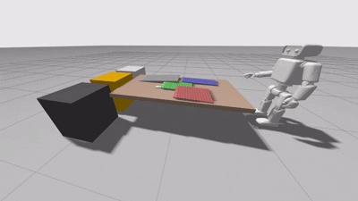

# 🤖 Meet C.O.R.I.  **[Cooperative Organizational Robotic Intelligence]**  

C.O.R.I. is a modular, ROS 2–based home assistant robot designed to automate household tasks like laundry sorting. This personal robotics R&D project lays the groundwork for real-world autonomy and home integration.

> _"I want AI to do my laundry and dishes so I can do my art and writing, not to do my art and writing so I can do my laundry and dishes."_

That’s exactly why I built CORI. 

This isn't about automating tasks—it's about reclaiming our time and energy by simplifying the same mundane tasks we've been doing by hand since the 60s. CORI is here to buy back time so we can focus on what truly matters. Instead of replacing human connection, it creates space for more of it. CORI's future will be centered around collaboration and adaptive behavior through behavioral modeling and pattern recongition, with the sole focus of improving quality of life. Right now CORI just sorts laundry, but soon, he will unload your groceries, take out your trash, and streamline the parts of your schedule, finally freeing up more of your time so you can focus on what's important to you.

---

## 📢 Latest Updates

  

  <table>
   <tr>
      <td colspan="2" align="center">
         
        
         <b>Environment Gravity Demo</b> 
        <em>CORI Full Body Render with Darks, Lights, Color Hampers + Table and Virtual Clothing with Gravity</em>
      </td>
    </tr>
    <tr>
      <td width="50%" align="center">
        
         <b>Physical Demo</b> 
        <em>30FPS Detection Using Camera on Multi-Colored Book</em>
      </td>
      <td width="50%" align="center">
        
         <b>Virtual Demo</b> 
        <em>Output from CORI's Model in Gazebo to Console</em>
      </td>
    </tr>
    <tr>
      <td width="50%" align="center">
         
        
         <b>CORI Model Rendered in Blender</b> 
      </td>
      <td width="50%" align="center">
         
        
         <b>CORI's Color Sorting CV in Darkroom</b> 
      </td>
    </tr>
  </table>

---

## 🔧 Update Log

| Version | Date         | Description                                     | Link                                                    |
|---------|--------------|-------------------------------------------------|---------------------------------------------------------|
| `v1.3`  | June 19, 2025 | Completed Color Sorting Vision + Gazebo Connection  | [View v1.3](docs/project_updates/v1.3_update.md)       |
| `v1.2`  | June 15, 2025 | First Render of CORI + Laundry World in Gazebo | [View v1.2](docs/project_updates/v1.2_update.md)       |
| `v1.1`  | June 11, 2025 | GUI + bounding boxes stable at 30 FPS          | [View v1.1](docs/project_updates/v1.1_update.md)       |
| `v1.0`  | June 9, 2025  | First version of laundry color detection system | [View v1.0](docs/project_updates/v1.0_update.md)      |

---

## 🚀 Project Overview

This initial phase includes:

1. **ROS 2 Workspace Setup**  
   - Install ROS 2  
   - Configure a `colcon` workspace  
   - Install dependencies

2. **Basic Robot Model & Simulation**  
   - Build a URDF of a mobile base with a camera  
   - Simulate in Gazebo Harmonic + RViz2

3. **Color-Based Laundry Sorting**  
   - ROS 2 node using OpenCV with HSV filtering  
   - Detect and classify laundry colors in simulation

---

## ✨ Key Features

- **ROS 2 Native**  
  Modular architecture built with ROS 2 for flexibility and scalability.

- **Gazebo Simulation**  
  Simulates a mobile robot with an RGB camera in Gazebo Harmonic and RViz2.

- **Color-Based Laundry Sorting**  
  Uses OpenCV (Python) and HSV filtering for real-time color classification.

- **Scalable Design**  
  Structured to support future modules for navigation, manipulation, and behavior planning.

---

## 🛠️ Tech Stack

| **System Layer**     | **Tools / Frameworks**           |
|----------------------|----------------------------------|
| **Operating System** | Ubuntu 22.04 + ROS 2       |
| **Simulation**       | Gazebo Harmonic, RViz2           |
| **Computer Vision**  | OpenCV (Python)                  |
| **Robot Control**    | rclpy, Launch Files              |
| **Phase 2+**    | TensorFlow, PyTorch, Behavior Trees    |

---

## 🔄 Development Roadmap

- [x] ROS 2 install & workspace setup  
- [x] Mobile base URDF + Gazebo Harmonic model
- [x] Color detection GUI at 30 FPS              
- [ ] (Future) Navigation + SLAM integration  
- [ ] (Future) Arm manipulation + gripper control  
- [ ] (Future) Task planning (Behavior Tree or FSM)

---

## 🔮 Vision for the Future

Most household robots follow commands. **CORI adapts with you.**

Where others automate tasks, CORI forms a relationship, remembering, and collaborating. It doesn't just act; it listens, asks, and grows with you.

---

## Phase 1: Recognition ✅ *(Completed on June 19th, 2025)*
**"Teaching CORI to see"**

- Real-time object detection, color classification, and basic sorting logic
- Built in ROS 2 with a functioning Gazebo simulation pipeline
- **Result:** A fully working perception-to-action loop at 30 FPS

---

## Phase 2: Adaptation 🚧
**"Teaching CORI to learn with you"**

- Learns user preferences (e.g., blue shirt with white trim = wash separately)
- Engages in cooperative decision-making ("I think this is a dark—do you agree?")
- Remembers context, energy levels, time of day
- Handles uncertainty with confidence scores and natural-language explanations

---

## Phase 3: Human Cooperation 🤝
**"Teaching CORI to truly help"**

- Offers personalized meal prep advice based on stress or habits
- Suggests cleaning routines based on patterns, schedules, or moods
- Becomes a reliable partner across kitchen, laundry, home, and health
- Evolves from **tool → assistant → teammate**

---

## ❤️ Core Beliefs

- **Memory Engine:** Learns your routines, context, and corrections
- **Communication Layer:** Uses natural language and emotional cues to engage
- **Task Modules:** Kitchen, laundry, wellness, and household organization
- **Learning Core:** Cross-task adaptation, uncertainty handling, reinforcement over time

## 💫 Why It Matters

We don't need smarter assistants. **We need better teammates.**

CORI builds a relationship—not just a pipeline.

- Helps when you're overwhelmed
- Asks when it's unsure
- Remembers how you like things done
- Evolves to fit your life

This isn't about replacing people. **It's about building robots that understand us.**

---

[**🌐 Project Page → juptegraph.dev**](https://juptegraph.dev)  

---

## 📜 License

Copyright (c) 2025 Johnathan Uptegraph  
All rights reserved.

This software and associated documentation files are proprietary and confidential. Unauthorized copying, distribution, modification, or commercial use is strictly prohibited.

> ⚠️ **Important Notice:** This project contains proprietary technology developed by Johnathan Uptegraph. While the code is visible for demonstration purposes, all rights are reserved. All visual assets, robot designs, and documentation are the intellectual property of Johnathan Uptegraph.

For licensing inquiries: jwuptegraph@gmail.com

---

> **Not just a robot. A promise in motion.**
