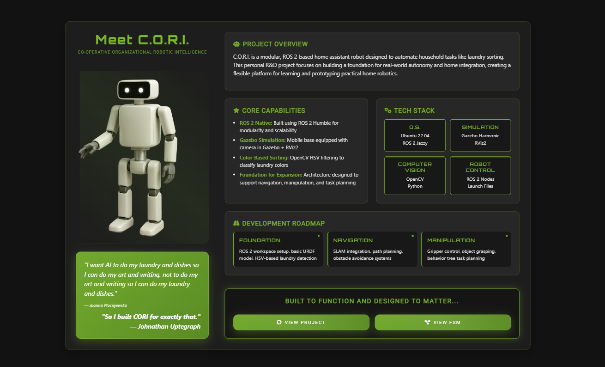

# 🤖 Meet C.O.R.I. 
**Co-Operative Organizational Robotic Intelligence**  
C.O.R.I. is a modular, ROS 2–based home assistant robot designed to automate household tasks like laundry sorting. This personal robotics R&D project focuses on building a foundation for real-world autonomy and home integration.

 [**Project Page** → juptegraph.dev](https://juptegraph.dev)

> **Built to function—but designed to matter.**

---

## 🧠 Vision Statement

> _"I want AI to do my laundry and dishes so I can do my art and writing, not to do my art and writing so I can do my laundry and dishes."_  

I built CORI for exactly that reason. The goal isn’t just automation—it’s an improvement in quality of life. By offloading tedious domestic tasks to a collaborative personal assistant, the aim is to buy back people’s time.

Built with ROS 2, Gazebo, and simulation tooling, CORI is both a functional robotics platform and a deeply personal one—a place to prototype assistive intelligence that learns, adapts, and helps people reclaim the hours they never meant to spend sorting their socks.

— *Johnathan Uptegraph*

---

## 🚀 Project Overview

This initial phase focuses on:

1. **ROS 2 Workspace Setup**  
   - Install ROS 2 Jazzy  
   - Configure a `colcon` workspace  
   - Install dependencies

2. **Basic Robot Model & Simulation**  
   - Create a URDF for a mobile base with a camera  
   - Simulate it in Gazebo Harmonic + RViz2

3. **Color-Based Laundry Sorting**  
   - Develop a ROS 2 node using OpenCV (HSV filtering)  
   - Detect and classify laundry colors in simulation

---

## 🧠 Key Features

- **ROS 2 Native**  
  Built using ROS 2 Jazzy for modularity and scalability.

- **Gazebo Simulation**  
  Mobile base with vision sensor simulated in Gazebo Harmonic + RViz2.

- **Color-Based Laundry Sorting**  
  Uses OpenCV (Python) with HSV filtering to classify laundry items.

- **Foundation for Expansion**  
  Architecture designed to support future modules for navigation, manipulation, and task planning.

---

##  📢 Latest Update

### 🧺 CORI Laundry Sorting — v1.0 Update (June 9, 2025)

<table>
  <tr>
    <td></td>
    <td>Finished the first version of **CORI’s laundry color detection system**.

- **Reads live webcam feed** at ~60 FPS  
- **Detects clothing items** in the frame  
- **Classifies by color:**  
  - LIGHTS (e.g., white)  
  - DARKS (e.g., black)  
  - COLORS (e.g., red, blue, green)  
- **Draws bounding boxes** around each item with the corresponding color  
- **Displays a live summary** in the top-right corner showing:  
  - Total items  
  - Count per category

Built in Python with OpenCV and ROS 2.

**Next step:** Trigger scanning only when a new bin is presented or an item is picked. Vision is currently coming from a basic webcam—but the idea is that CORI will eventually scan from cameras in the palms before grasping.

Progress is solid. 📈  

> Considering a shift to Moondream instead of OpenCV for more advanced clothing detection and low-level logic.

</td>
  </tr>
</table>

---

## 🛠️ Tech Stack

| **System Layer**     | **Tools / Frameworks**           |
|----------------------|----------------------------------|
| **OS**               | Ubuntu 22.04 / ROS 2 Jazzy       |
| **Simulation**       | Gazebo Harmonic / RViz2          |
| **Computer Vision**  | OpenCV (Python)                  |
| **Robot Control**    | ROS 2 Nodes / Launch Files       |

---

## 🔄 Development Roadmap

- [x] ROS 2 Jazzy install & workspace setup  
- [ ] Mobile base URDF & Gazebo Harmonic model  
- [ ] HSV-based laundry detection node  
- [ ] (Future) Navigation & SLAM integration  
- [ ] (Future) Manipulation & gripper control  
- [ ] (Future) Task planning (Behavior Tree or FSM)

---

## 📜 License

MIT License © 2025 Johnathan Uptegraph  
See [LICENSE](LICENSE) for full text.

> ⚠️ All visual assets, robot designs, and documentation are the intellectual property of Johnathan Uptegraph. This repository is for educational and personal-portfolio use only.

---

- **Simulation Logs:** *TBD*

---

> **Not just a robot. A promise in motion.**
