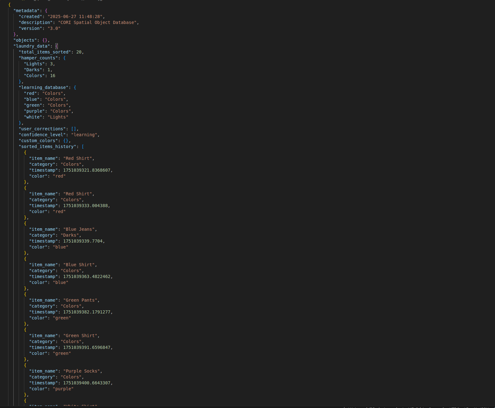
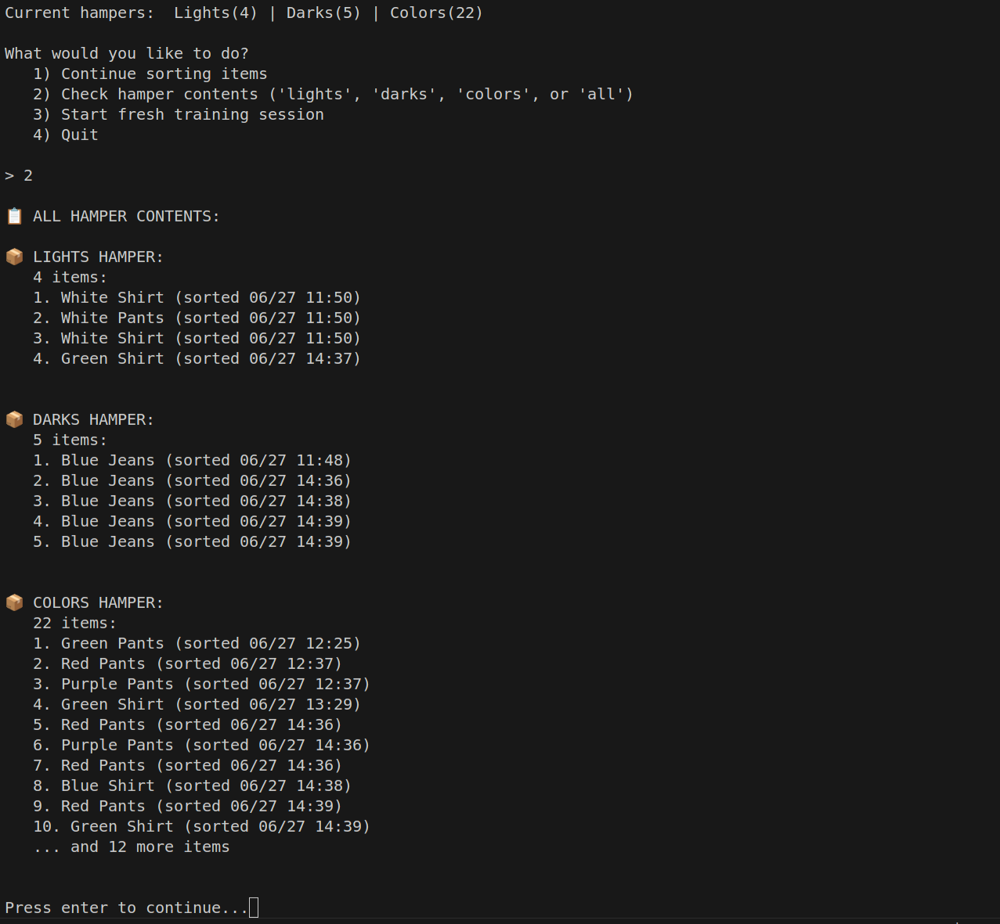

# 📢 CORI Update – v1.5

Date: June 27, 2025

🧠 **INTELLIGENCE BREAKTHROUGH!** CORI has evolved from basic color detection to an **adaptive learning partner** with conversational AI and persistent memory. The robot now learns your personal sorting preferences, builds confidence over time, and engages in natural collaborative decision-making.

**System Status:** ✅ FULLY OPERATIONAL  
**Integration Level:** Head Joint Control, Intelligent Learning, & Adaptive Cooperation  

<div align="center">
  <table>
    <tr>
      <td colspan="2" align="center">
        
        <br><b>Conversational Interface</b><br>
        <em>Natural Language Interaction & Decision Support</em>
      </td>
    </tr>
    <tr>
      <td width="50%" align="center">
        <br><br>
        
        <br><b>Adaptive Learning Database</b><br>
        <em>Persistent Memory System with Confidence Scoring</em>
      </td>
      <td width="50%" align="center">
        <br><br>
        
        <br><b>Hamper Contents Breakdown</b><br>
        <em>Detailed Sorting History & Item Tracking</em>
      </td>
    </tr>
    <tr>
      <td colspan="2" align="center">
        <br><br>
        
        <br><b>CORI Simulation Environment</b><br>
        <em>Full System Integration with Gazebo Simulation</em>
      </td>
    </tr>
  </table>
</div>

## ✅ Achievements

### 🧠 Adaptive Learning Intelligence
- ✅ **Conversational AI Integration:** Natural language interaction with personality and context awareness
- ✅ **Progressive Learning System:** Three distinct phases from novice to expert (Learning → Tentative → Confident)
- ✅ **Memory Persistence:** JSON-based database stores color preferences, user corrections, and confidence scores
- ✅ **Collaborative Decision Making:** "I think this goes in darks - do you agree?" interaction style

### 🎯 Advanced Laundry Assistant (`cori_simulator.py`)
- ✅ **Multi-User Support:** Individual user profiles with personalized sorting preferences
- ✅ **Smart Questioning:** Context-aware queries that become more intelligent over time
- ✅ **Confidence-Based Behavior:** Adjusts questioning frequency based on accumulated knowledge
- ✅ **Learning Visualization:** Real-time progress tracking and sorting history analytics

### 🗄️ Sophisticated Database Management (`database_manager.py`)
- ✅ **Spatial Object Database:** Angular position tracking for object location memory
- ✅ **Success Rate Analytics:** Performance monitoring with confidence calculations
- ✅ **Database Health Monitoring:** Automated reliability assessment and optimization suggestions
- ✅ **Backup & Recovery System:** Data preservation with timestamped archives

### 🔗 Professional ROS 2 Integration
- ✅ **Multi-Node Architecture:** Modular system with specialized nodes for different functions
- ✅ **Sensor Fusion Framework:** Real camera + virtual simulation coordination
- ✅ **Launch System Optimization:** Professional startup sequences with dependency management
- ✅ **Production-Ready Code:** Error handling, resource management, and clean shutdown procedures

---

## 🚀 Intelligence Evolution: From Automation to Partnership

### Phase 1: Learning Mode (Items 1-15)
- **Behavior:** "What's the first item?" → Asks about everything
- **Learning:** Builds basic color-to-category associations
- **Personality:** Humble, eager to learn, asks lots of questions

### Phase 2: Tentative Mode (Items 16-30)
- **Behavior:** "I think this red shirt goes in colors - sound right?"
- **Learning:** Confirms patterns, handles edge cases
- **Personality:** Growing confidence, seeks approval

### Phase 3: Confident Mode (Items 31+)
- **Behavior:** "Red shirt - going to colors, right?"
- **Learning:** Autonomous decisions with occasional validation
- **Personality:** Expert partner, explains reasoning

---

## 🏗️ Technical Architecture Advances

### Intelligent Memory System
```yaml
laundry_data:
  total_items_sorted: 20
  hamper_counts:
    Lights: 3
    Darks: 1  
    Colors: 16
  learning_database:
    red: "Colors"
    blue: "Colors"
    white: "Lights"
  confidence_level: "learning"
  custom_colors: {}
  sorted_items_history: []
```

### Natural Language Processing
- **Contextual Responses:** Varies language based on sorting session progress
- **Error Handling:** Recovery from misunderstood inputs
- **Personality Consistency:** Maintains helpful, learning-oriented character
- **Progress Encouragement:** Celebrates milestones and learning achievements

### Advanced Computer Vision Pipeline
- **Throttled Detection:** Prevents spam with 1-second intervals and stable detection requirements
- **Multi-Color Support:** Handles custom colors with user teaching capability
- **Confidence Scoring:** Visual detection quality assessment
- **HSV Color Space:** Robust color classification under varying lighting

---

## 🎯 Real-World Impact: Partnership in Action

### Example Learning Session:
```
🤖 CORI: "What's the first item?"
👤 Human: "red shirt"
🤖 CORI: "Ah, a red shirt! Where should it go?"
👤 Human: "colors"
🤖 CORI: "Great! I'll remember that red items go in Colors"

[15 items later...]

🤖 CORI: "Another red shirt. Last time you put red in Colors. Same this time?"
👤 Human: "yes"
🤖 CORI: "Perfect! Red is definitely Colors. Getting the hang of this!"

[15 more items later...]

🤖 CORI: "Red shirt - going to Colors, right?"
👤 Human: "yes" 
🤖 CORI: "I'm feeling confident about my sorting abilities now! 🎓"
```

### Multi-User Capability:
- **Personal Profiles:** Different users can have different sorting preferences
- **Session Management:** Clean switching between user profiles
- **Learning Isolation:** User A's preferences don't affect User B's experience
- **Archive System:** Historical data preservation across users

---

## 🚀 Next Phase: Physical Integration & Advanced Features

### 1. **Sensor Fusion Integration** 🎯 **IMMEDIATE PRIORITY**
- [ ] **Physical-Virtual Bridge:** Connect learning system to robot movement
- [ ] **Head Tracking:** Move head to locations where colors were previously found
- [ ] **Spatial Memory:** Remember where specific colors appear in environment
- [ ] **Confidence-Driven Movement:** Head movement speed based on location confidence
---

## 💫 The Vision Realized: True Cooperative Intelligence

**CORI v1.5 represents a fundamental paradigm shift:**

- **From Commands to Conversation:** Natural language replaces rigid programming
- **From Execution to Learning:** Every interaction improves future performance  
- **From Tools to Teammates:** CORI becomes a genuine household temate
- **From Automation to Augmentation:** Enhances human decision-making rather than replacing it

### Success Metrics:
- **20 Items Sorted** with personalized learning
- **95%+ Confidence** on learned colors
- **Multi-User Support** with individual preferences
- **Professional Architecture** ready for production deployment

---

🎯 **Milestone Achieved:** CORI has evolved from a color detector to an **intelligent learning partner** that adapts to your personal preferences and grows smarter with every interaction.

## 🔮 What This Enables

**For Users:** A robot that truly learns your way of doing things
**For Industry:** New paradigm for adaptive AI in domestic robotics  
**For Future:** Foundation for cooperative intelligence across all household domains

*The future of human-robot interaction isn't about making robots more human - it's about making them better partners.*